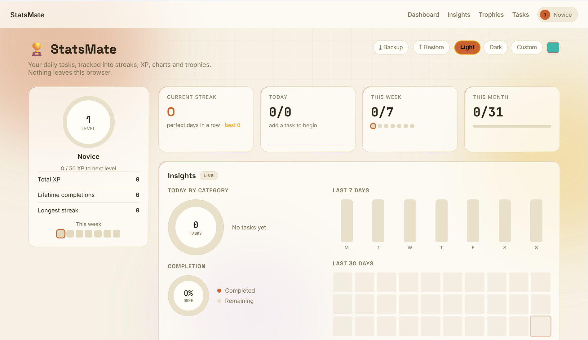
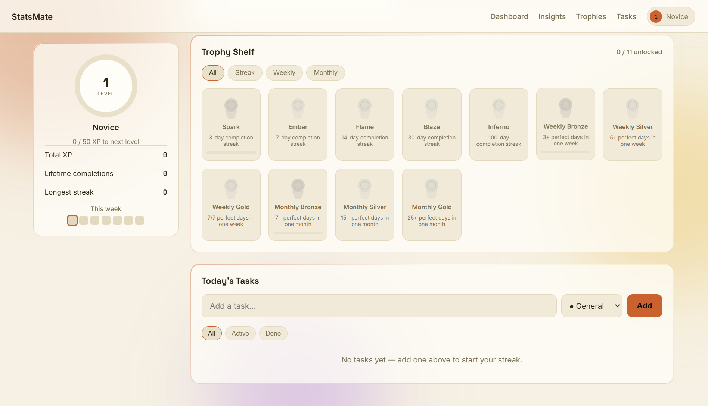
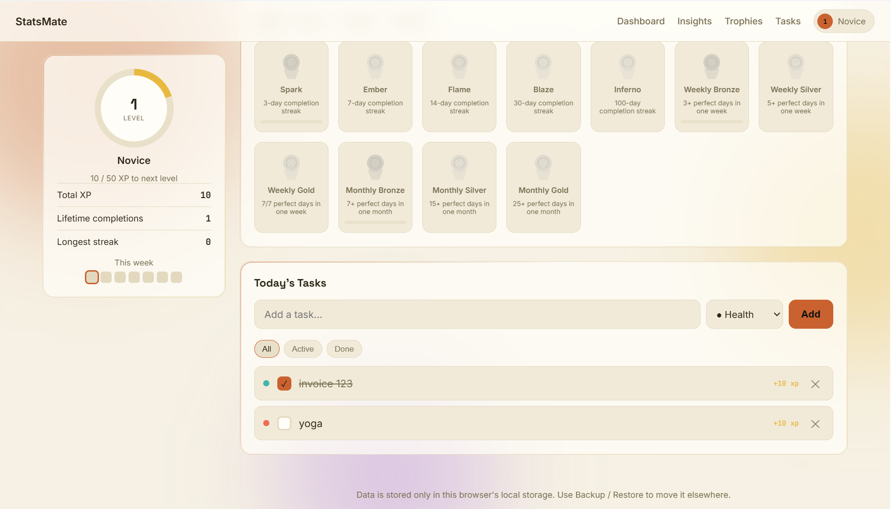

# 📊 StatsMate

StatsMate is a gamified productivity and daily task tracking application.

It helps users track their daily tasks, earn XP, maintain streaks, unlock trophies, and view productivity statistics.

StatsMate is built using **HTML, CSS, JavaScript, and Electron**.
---

# 📥 Installation

1. Download **StatsMate Setup 1.0.0.exe** from the Assets section below in the release section on right.
2. Run the installer.
3. Complete the installation.
4. Launch **StatsMate** from your Desktop or Start Menu.

---

## ✨ Features

- Daily task management
- XP and leveling system
- Productivity streaks
- Trophies and achievements
- Productivity statistics
- Weekly and monthly progress
- Light and dark themes
- Custom accent colors
- Local data storage
- Backup and restore functionality
- Windows desktop application

---

## 📸 Screenshots

### Dashboard & Task Management


### Trophy Shelf


### Insights & Analytics Dashboard


---

## 🛠️ Technologies Used

- HTML5
- CSS3
- JavaScript
- Electron
- Node.js
- LocalStorage
- SVG
- CSS Animations

---

## 📁 Project Structure

```text
StatsMate/
│
├── index.html
├── sideui.css
├── sidemain.js
├── main.js
├── icon.ico
├── package.json
├── package-lock.json
├── README.md
├── LICENSE
└── .gitignore
```

---

# 🧩 How the Code Works

StatsMate is divided into separate files so developers can easily modify different parts of the application.

---

## `index.html`

Contains the structure and content of the application.

Modify this file to change:

- Page structure
- Text
- Buttons
- Sections
- Cards
- Task layout
- Trophy layout
- Statistics layout
- HTML elements

---

## `sideui.css`

Controls the design and appearance of StatsMate.

Modify this file to change:

- Colors
- Fonts
- Spacing
- Sizes
- Layout
- Buttons
- Cards
- Borders
- Shadows
- Animations
- Light theme
- Dark theme
- Responsive design

If you want to change how something looks, you will usually edit `sideui.css`.

---

## `sidemain.js`

Contains the main application functionality.

Modify this file to change:

- Adding tasks
- Completing tasks
- Deleting tasks
- Editing tasks
- XP calculations
- Level progression
- Streak calculations
- Trophy unlocking
- Productivity statistics
- Themes
- LocalStorage
- Backup and restore functionality

If you want to add a new feature or change how StatsMate behaves, start by looking in `sidemain.js`.

---

## `main.js`

Controls the Electron desktop application.

It is responsible for creating the desktop window and loading StatsMate.

Modify this file to change:

- Application window size
- Minimum window size
- Electron configuration
- Desktop-specific features
- Application menus
- Native desktop functionality

---

## `icon.ico`

This is the Windows application icon.

It is used for:

- The generated `.exe` installer
- The installed StatsMate application
- The Windows application icon

---

# 🚀 Run StatsMate Locally

## 1. Install Node.js

Install Node.js from:

https://nodejs.org/

Check that Node.js is installed:

```bash
node --version
npm --version
```

---

## 2. Clone the Repository

```bash
git clone https://github.com/lucifer4rout/StatsMate.git
```

Move into the project directory:

```bash
cd StatsMate
```

---

## 3. Install Dependencies

```bash
npm install
```

This installs all dependencies required by StatsMate, including Electron and Electron Builder.

---

## 4. Start the Application

```bash
npm start
```

The StatsMate desktop application will open.

---

# ✏️ Modifying StatsMate

To modify StatsMate:

1. Clone the repository.
2. Open the project in a code editor such as Visual Studio Code.
3. Install the dependencies:

```bash
npm install
```

4. Modify the file related to the change you want to make.
5. Run the application:

```bash
npm start
```

6. Test your changes.

---

## 🗂️ Quick Guide

| What you want to change | File to edit |
|---|---|
| Page structure and content | `index.html` |
| Design and appearance | `sideui.css` |
| Application functionality | `sidemain.js` |
| Desktop application behavior | `main.js` |
| Windows application icon | `icon.ico` |

---

# ➕ Adding a New Feature

When adding a new feature, follow these steps.

## 1. Add the Required HTML

Add the interface or elements to:

```text
index.html
```

---

## 2. Add the Styling

Add the required styles to:

```text
sideui.css
```

---

## 3. Add the Functionality

Add the JavaScript logic to:

```text
sidemain.js
```

---

## 4. Test the Feature

Run:

```bash
npm start
```

Make sure the feature works correctly before building the application.

---

# 🏗️ Building the Windows Application

StatsMate uses Electron Builder to create a Windows installer.

After making your changes, run:

```bash
npm run build
```

The build process will create a new directory:

```text
dist/
```

The Windows installer will be located inside:

```text
dist/StatsMate Setup 1.0.0.exe
```

The exact filename may change depending on the version specified in `package.json`.

For example:

```text
dist/
└── StatsMate Setup 1.0.0.exe
```

This `.exe` file can be shared with Windows users.

---

## 🔄 Building After Making Changes

Whenever you modify the code:

```bash
npm start
```

Test the application first.

If everything works correctly:

```bash
npm run build
```

The new installer will be generated inside:

```text
dist/
```

---

## ⚙️ How the Build Works

The build process is:

```text
Source Code
    ↓
index.html
sideui.css
sidemain.js
main.js
    ↓
npm run build
    ↓
Electron Builder
    ↓
dist/
    ↓
StatsMate Setup 1.0.0.exe
```

---

# 💾 Data Storage

StatsMate currently stores application data locally using **LocalStorage**.

This includes:

- Tasks
- XP
- Levels
- Streaks
- Trophies
- Statistics
- Theme preferences

Users can use the built-in **Backup and Restore** functionality to export and restore their data.

---

# 📦 Important Files

The following folders and files should **not** be committed to GitHub:

```text
node_modules/
dist/
```

These are ignored using `.gitignore`.

Anyone who clones the repository can install the required dependencies using:

```bash
npm install
```

---

# 🤝 Contributing

Contributions are welcome.

## 1. Fork the Repository

Fork this repository on GitHub.

---

## 2. Clone Your Fork

```bash
git clone https://github.com/YOUR_USERNAME/StatsMate.git
```

---

## 3. Create a Branch

```bash
git checkout -b feature/my-feature
```

---

## 4. Make Your Changes

Edit the appropriate files:

```text
index.html   → Structure and content
sideui.css   → Styling and design
sidemain.js  → Application logic
main.js      → Electron functionality
icon.ico     → Application icon
```

---

## 5. Test Your Changes

```bash
npm install
npm start
```

---

## 6. Build and Test the Windows Application

```bash
npm run build
```

The generated installer will be located inside:

```text
dist/
```

---

## 7. Commit Your Changes

```bash
git add .
git commit -m "Describe your changes"
```

---

## 8. Push Your Branch

```bash
git push origin feature/my-feature
```

Then open a Pull Request on GitHub.

---

# 📄 License

This project is licensed under the terms specified in the `LICENSE` file.

---

Made with ❤️ by **lucifer4rout**
